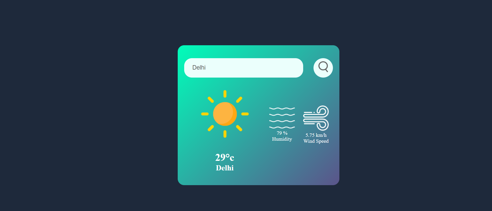

# Weather App



The **Weather App** is a simple and intuitive web application that allows users to check the weather conditions for a specific city. With a clean and user-friendly interface, it provides real-time weather data to keep you informed about the current weather, temperature, humidity, and wind speed.

## Features

- **City-based Weather:** Enter the name of a city, and the app will fetch and display the current weather conditions for that location.

- **Real-time Updates:** The app provides up-to-date weather information, ensuring that you always have access to the latest data.

- **Weather Icons:** Icons representing different weather conditions, such as clear skies, clouds, rain, drizzle, snow, and mist, help you visualize the weather at a glance.

- **Temperature Conversion:** The temperature is displayed in both Celsius and Fahrenheit, allowing users to choose their preferred unit.

- **Humidity and Wind Speed:** Get additional details about humidity and wind speed to plan your day accordingly.

## Functions

- **Search Weather:** Enter the name of a city in the search bar and click the search button to fetch and display the current weather conditions.

- **Dynamic Icons:** Based on the weather description, the app dynamically selects and displays appropriate weather icons to represent the conditions.

- **Real-time Updates:** The app automatically updates the weather data, ensuring that you always have access to the most recent information.

- **User-friendly Interface:** With an easy-to-use interface, the Weather App provides a seamless experience for checking weather conditions.

Experience the Weather App and stay informed about the weather in your favorite cities!
## Features

- **Fully Responsive:** The website is designed to be fully responsive, ensuring an optimal viewing experience on various devices.

## Tech Stack

- **Front-end Library:** React
- **Styling:** CSS
- **Server-side Language:** JavaScript
- **Open Weather API**
-  Axios (for making API requests)

## Installation & Usage

To run the Weather App locally or make further enhancements, follow these simple steps:

1. Clone the repository:

   ```bash
   git clone https://github.com/aryan-prog/weather-app.git
   cd weather-app
   ```

2. Open the `index.html` file in your web browser.

3. Enter the name of the city you want to check the weather for, and click the search button.

4. Enjoy real-time weather updates!

## Live Demo

Experience the live version of the Portfolio Website at [Live Demo](https://weather-app-seth.netlify.app/).

## Motivation

This project serves as a testament to my passion for web development and showcases my ability to combine creativity with technical skills to create a visually captivating and functional portfolio.

## Contributing

Contributions to the Personal Portfolio Website are welcome! If you have any ideas, suggestions, or improvements, please feel free to open an issue or submit a pull request.

The **Weather App** exemplifies my dedication to presenting my skills and experiences in a creative and engaging manner. I hope this project provides a comprehensive and impressive representation of my capabilities as a software developer. Thank you for visiting my portfolio website! If you have any questions or would like to get in touch, please feel free to contact me at [seth.aryan605@gmail.com](mailto:seth.aryan605@gmail.com). Happy coding!
